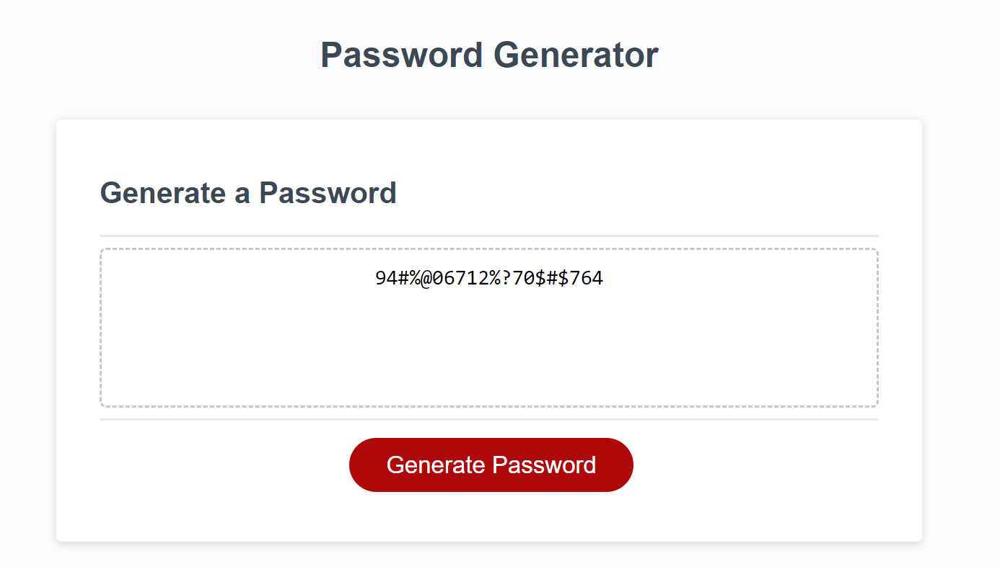

# Fancy.Password.Maker
## A password generator that will create dynamic and secure passwords for the user to use across multiple applications

A password generator that will take the user through a series of prompts, including length, and character types desired, in order to create an ideal password.  The user must stay within certain parameters or else an alert will pop up. Once the choices are made within the parameters, a password will show up on the screen.

## Screenshots

## [liveURL](https://rachaelkstokes.github.io/Fancy.Password.Maker/)
